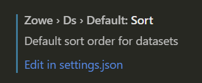
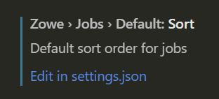

# Configuring Zowe Explorer

:::info Required role: Developer
:::

Configure Zowe Explorer in the settings file so the extension performs according to your preferences.

To access Zowe Explorer settings:

1. Click the **Manage** icon at the bottom of the **Activity Bar**.
2. Select the **Settings** option.
3. Open the **Extension** option listed in the **Commonly Used** menu.
4. Select **Zowe Explorer** to access its settings.
5. Scroll the list to find the setting that needs modification.

## Modifying creation settings for data sets, USS files, and jobs

1. In Zowe Explorer settings, scroll to a data set, USS file, or job setting type.
2. Click the setting's corresponding **Edit in settings.json** link.

    This opens the `settings.json` file in an **Editor** tab. (The suggestions widget also opens if the functionality is enabled.)

3. Edit the settings in the file as needed.
4. Save the file to keep changes.

    

## Modifying REST timeout settings

1. Navigate to Zowe Explorer Settings.
2. Scroll to **Zowe › Settings**
3. Determine which REST timeout to change:

    a. **Socket Connect Timeout** - Specify the maximum number of milliseconds to wait for the REST client to perform the initial connection and handshake with the server.

    b. **Request Timeout** - Specify the maximum number of milliseconds to wait for a REST request to complete.

## Modifying pagination options for data sets

Zowe Explorer v3.2 and above have pagination enabled by default when listing data sets and PDS members, splitting the results into pages rather than showing all items at once.
To configure the number of data sets and PDS members to display per page:

1. Navigate to Zowe Explorer settings.
2. Scroll to **Zowe › Ds › Paginate: Data Sets Per Page**.
3. Specify the number of items to list per page in the input box.
   Set the value to zero to disable pagination for data sets and PDS members.

## Modifying the `Secure Credentials Enabled` setting

When environment conditions do not support the Zowe CLI built-in credential manager, change the `Secure Credentials Enabled` setting:

 1. Navigate to Zowe Explorer settings.
 2. Scroll to **Security: Secure Credentials Enabled**.
 3. Deselect the checkbox to disable secure credentials.

    When disabled, if the `autoStore` setting in the `zowe.config.json` file is set to `true`, z/OS credentials are stored as text in the file.

    If the `autoStore` setting is set to `false`, you are prompted for the missing credentials in VS Code. The credentials are stored and used for the duration of the session.

## Setting confirmation requirements for submitting jobs

Submitting the wrong job can risk potential problems on your server. This can happen when the user enters the wrong job or inadvertently selects the **Submit Jobs** option.

To help prevent this, enable the option to require confirmation before submitting a job. Once enabled, a dialog window asking for user confirmation displays when **Submit Jobs** is selected.


To configure confirmation settings for submitting a job:

1. On the VS Code menu bar, click **File**, **Preferences**, and click **Settings** to display the Settings editor.

2. Select the **User** or **Workspace** tab, depending on the settings you want to update.
3. In the Settings navigation menu, open the **Extensions** menu and click **Zowe Explorer**.
4. In the **Jobs: Confirm Submission** section, open the drop-down menu to select a different confirmation setting.
    - If enabled, a confirmation dialog displays when a job matching the selected option is submitted.

## Modifying level of detail included in logs

To define the level of detail included in log files:

1. On the VS Code menu bar, click **File**, **Preferences**, and click **Settings** to display the Settings editor.

2. Select the **User** or **Workspace** tab, depending on the settings you want to update.
3. In the Settings navigation menu, open the **Extensions** menu and click **Zowe Explorer**.
4. In the **Logger** section, open the drop-down menu to select a different detail setting.

## Modifying the default sort order for data sets and jobs

To change the default sort order for data sets and jobs:

1. In Zowe Explorer settings, scroll to a data set or job setting type.
2. Click the setting's corresponding **Edit in settings.json** link.
3. This opens the `settings.json` file in an **Editor** tab.




:::tip

Alternately, on the VS Code Command Palette (`Ctrl`/`Cmd` + `Shift` + `P`), enter **Preferences: Open User Settings (JSON)** to display the Settings editor.

:::

The following allowed directions are available for sorting both data sets and jobs:

| Direction | Description |
| --- | --- |
| `Ascending` | Sorts in ascending order. |
| `Descending` | Sorts in descending order. |

The following allowed methods are available for sorting data sets:

| Method | Description | 
| --- | --- |
| `Name` | Sorts by the name of the data set. |
| `DateCreated` | Sorts by the date the data set was created. |
| `LastModified` | Sorts by the date the data set was last modified. |
| `UserId` | Sorts by the user ID who last modified the data set. |

The following allowed methods are available for sorting jobs:

| Method | Description |
| --- | --- |
| `Id` | Sorts by the job ID. |
| `DateSubmitted` | Sorts by the date the job was submitted. |
| `DateCompleted` | Sorts by the date the job was completed. |
| `JobName` | Sorts by the name of the job. |
| `ReturnCode` | Sorts by the return code of the job. |

### Examples
 
To change the default data set sort order to `LastModified` in `Descending` order, change the following setting in the `settings.json` file:

```json
"zowe.ds.default.sort": {
    "method": "LastModified",
    "direction": "Descending"
},
```


To change the default data set sort order to `DateCompleted` in `Ascending` order, change the following setting to the `settings.json` file:

```json
"zowe.jobs.default.sort": {
    "method": "DateCompleted",
    "direction": "Ascending"
},
```


